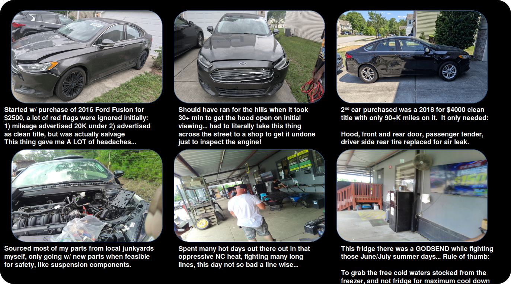
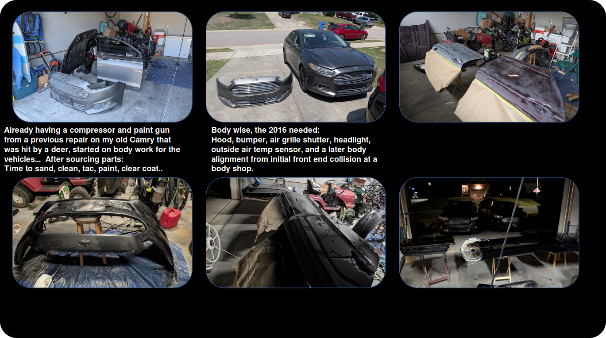
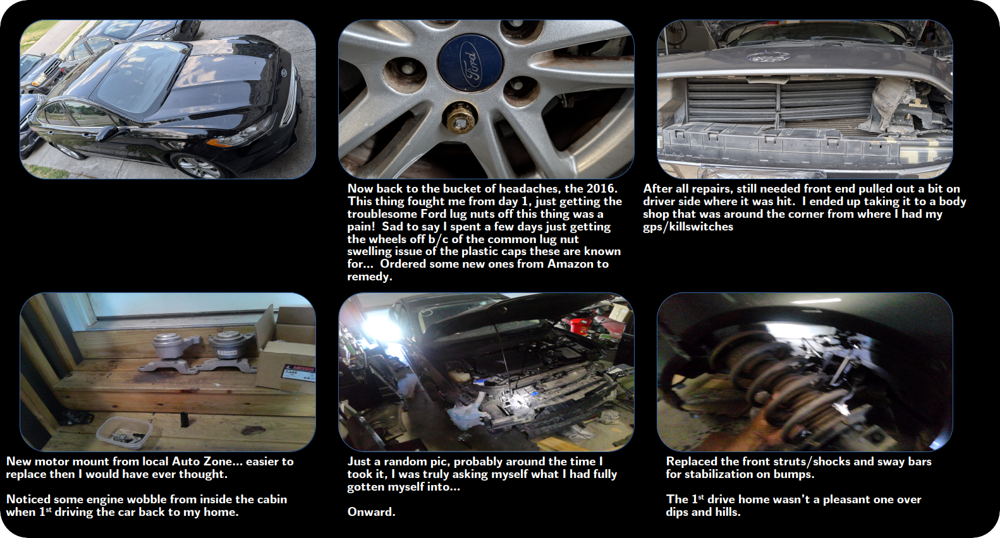
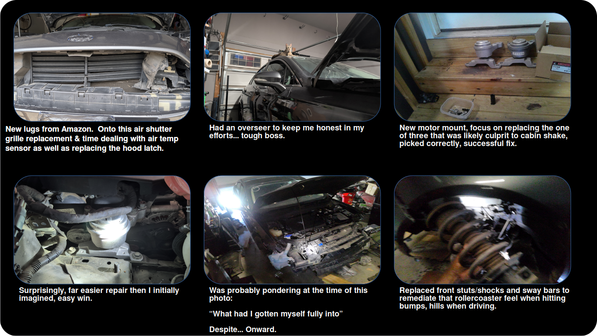
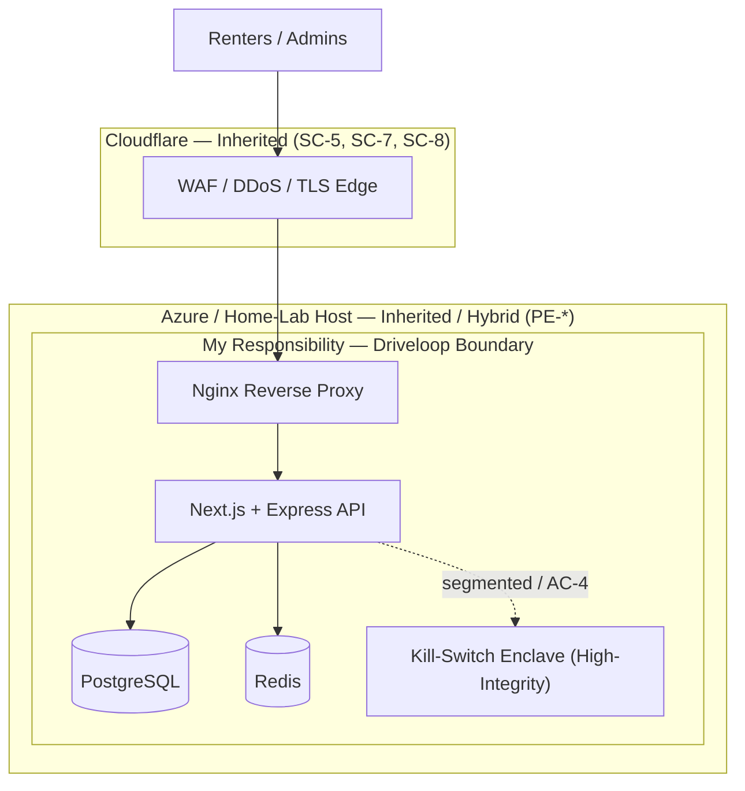

### [Home](https://github.com/Komonodrg-portfolio) | [Cybersecurity](https://github.com/Komonodrg-portfolio/Cybersecurity) | [Networking](https://github.com/Komonodrg-portfolio/Networking) | [Data Science (AI)](https://github.com/Komonodrg-portfolio/AI) | [Media Creation](https://github.com/Komonodrg-portfolio/MediaCreation) | [System Administration](https://github.com/Komonodrg-portfolio/System-Administration) | [Mission](https://github.com/Komonodrg-portfolio/Mission/)

---

---

# 🔐 Securing Driveloop — NIST SP 800-53 (Rev 5) Control Implementation

## 📌 Purpose

This page documents how I **first, setup my rideshare business** then went about **securing a real, operating platform** — my Driveloop rideshare / vehicle-rental marketplace — by applying the **NIST Special Publication 800-53 (Revision 5)** security and privacy control catalog through the **Risk Management Framework (RMF)** process.

It is written to do two things at once, in the spirit of this portfolio: **teach** the process of going about initiating a startup & showcasing the reasoning behind the security protocols I chose to employ that fit a small business, thus **showcasing** those skills as I implement them. This is a **living document** — the control matrix below is filled in as each control moves from *planned* to *implemented*, so you are watching the work happen, not reading a finished claim.

The goal is a **security-first, production-grade platform** that mirrors enterprise practice while demonstrating hands-on skills in:

- mechanical proficiency and problem solving
- System categorization and risk-based scoping
- Control tailoring, inheritance, and compensating-control design
- Secure infrastructure, identity, logging, and monitoring
- Documentation and continuous monitoring that would survive a real assessment

> *"Insist on yourself; never imitate.” — Ralph Waldo Emerson"* 

---

 <h2><em><b>🪂  "One Man's Thoughts..."</b></em></h2>
    
<em>After finishing up my last contract role as a Network Specialist / Systems Admin for the State of NC, D.H.H.S at the tail end of 06/26, instead of rushing immediately into finding another role, I decided to finally take time, decompress, and to do a few things for me, instead of chasing the rat race.  Though a daunting and nerve racking endeavor (see the Mrs.' constant questioning about this and that...understandably - of course) , I choose to do two things that I've always wanted to due, but the responsibilities of being a family didn't always permit, time wise:  1) I decided to take on my first Head Coach position for my Son's flag football team, and 2) I decided to start a Ride-share Rental Company.   
  
To say either pursuit hasn't been without it's own challenges would be the tallest of tales.  Though I've always been a tinkerer by heart and have gathered enough tools over the years to be prepared and proficient enough to take on various maintenance and repair items regarding vehicles and odd jobs around the house, truly jumping into the deep end and committing to the unknown was an exciting and scary place.  Taking on the Head Coaching role definitely helped ease the nerves a bit, especially when faced with road blocks in performing the repairs and finally seeing a path to green. Heck, amongst it all, I was even able to take a solo journey to knock off a few bucket list items.  Hope you enjoy the subsequent pics and the process behind my journey.</em> 
 
<b>Ride Share:</b> 
    
- Decided on (2) FB Marketplace Ford Fusions w/in last 10-16 yrs old, needing a little more TLC to prove that I could truly do this... SUCCESS.

<em>Colleagues,Onward. </em>

 

 
<h2><b>⚖️ An Honest Framing First (Read This)</b></h2>

NIST SP 800-53 is a **federal** control catalog. My Business, Driveloop, is a **private commercial** system — without  FISMA or FedRAMP oversight. I  **voluntarily align** to 800-53 because it's the most rigorous, defensible control library available, and private companies routinely borrow it to structure their security.

This real world project is NIST SP 800-53 **aligned** rather than **compliant** - a key distinction.

> 📎 **Catalog state (current):** NIST SP 800-53 is on **Rev 5**, latest patch release **5.2.0** (Aug 2025), which added software-update / patch-security controls (e.g., **SI-2(7) Root Cause Analysis**, an **SA-15** logging-syntax enhancement) under EO 14306. The catalog holds **20 control families**. Baselines live in **SP 800-53B**: Low ≈ 150, **Moderate ≈ 304**, High ≈ 392 controls.

---

## 🧭 System Overview

| Attribute | Description |
| --- | --- |
| **System name** | Driveloop — vehicle rental / rideshare marketplace |
| **Boundary** | Web application, its data stores, the reverse proxy, and the vehicle-command service — *not* the internet edge or datacenter (those are inherited, see below) |
| **Stack** | Nginx reverse proxy · Next.js (SSR) · Express API · PostgreSQL · Redis |
| **Edge** | Cloudflare (DNS, WAF, TLS termination, DDoS) |
| **Hosting** | Bare-metal Debian home lab today → migrating to Microsoft Azure |
| **Sensitive data** | User PII, identity-verification documents, background-check results, tokenized payment references, booking records, vehicle telematics + **remote kill-switch command authority** |

> 🔒 **OpSec note:** Exact IPs, hostnames, ports, and live config are intentionally **redacted** on this public page. What is shown is the *pattern*, not the production specifics — publishing those would violate the very boundary-protection (SC-7) and transparency (PT) controls this project is built on.

<h1><b>🦅 Scope</b></h1>

## 🗂️ Step 1 — System Categorization (FIPS 199)

Per **FIPS 199 / NIST SP 800-60**, I rate the potential impact of a loss of **Confidentiality, Integrity, and Availability**, then take the **high-water mark** as the overall level.

| Security Objective | Impact | Rationale |
| --- | --- | --- |
| **Confidentiality** | **MODERATE** | Identity documents and background-check data are sensitive PII; a breach causes serious harm to individuals. Card data is outsourced to the payment processor, which deliberately caps this objective. |
| **Integrity** | **MODERATE** | Tampering with bookings, balances, or verification status causes financial/legal harm. The **kill-switch command path is treated as a High-integrity enclave** (disabling a moving vehicle is a safety issue) and is segmented accordingly. |
| **Availability** | **MODERATE** | A real operating business — downtime means lost revenue and stranded renters — but not life-safety. |

### 🎯 Overall System Categorization

 **System Categorization = { (Confidentiality, MODERATE), (Integrity, MODERATE), (Availability, MODERATE) }**
 **➡️ Overall Impact Level: MODERATE**

---

## 🎚️ Step 2 — Baseline Selection

The categorization drives the baseline directly. I selected the **Moderate** baseline from SP 800-53B, as it best aligns with business strategy.

| Baseline | Verdict | Why |
| --- | --- | --- |
| **Low** | ❌ Rejected | Undersells identity-document and PII sensitivity — that's a no-no |
| **Moderate** | ✅ **Selected** | Matches the categorization and is a baseline I can *truthfully* implement and evidence. |
| **High** | ❌ Rejected | ~392 controls is unimplementable for a solo operator. I keep the *system* at Moderate and elevate only the kill-switch **enclave**. |

---

## 🧬 Step 3 — Control Inheritance Model

The single biggest efficiency lever in RMF is **not re-implementing what a provider already gives me**. Controls I inherit (common controls) are marked as such rather than re-built — I document *which* control, *which* provider, and *which* portion.

| Layer | Owner | Representative Controls | Treatment |
| --- | --- | --- | --- |
| Internet edge (WAF, DDoS, TLS) | **Cloudflare** | SC-5, SC-7 (partial), SC-8 (partial) | 🔵 Inherited |
| Physical & environmental | **Azure** (post-migration) | PE-2, PE-3, PE-6, PE-13 | 🔵 Inherited |
| Physical (home-lab today) | **Me** | PE-2, PE-3 | 🟡 My responsibility until migration |
| OS / platform hardening | **Me** | AC, IA, CM, SI | 🟡 System-specific |
| Application & data | **Me** | AC, AU, SC-28, PT | 🟡 System-specific |
| Kill-switch enclave | **Me** | AC-4, SC-7, high-integrity | 🟡 Segmented, elevated |

> 💡 The **home-lab → Azure** move is a teaching gift: today *I* own the PE family; after migration I *inherit* it. Showing both states proves I understand the **shared-responsibility model**, not just the checklist.

---

## 🎛️ Step 4 — Tailoring Decisions

Tailoring is the four moves that turn a generic baseline into *my* control set.

### ➖ Scoped-Out (with justification)

| Control(s) | Justification |
| --- | --- |
| **PS-3, PS-4** (Personnel Screening / Termination) | Single system owner, no workforce to screen or off-board. Documented scope-out, not an oversight. |
| **PE-\*** (post-migration) | Inherited from Azure — not implemented by me once migrated. |

### 🟠 Compensating Controls

| Baseline Gap | Compensating Control | Why It's Equivalent |
| --- | --- | --- |
| **AC-5** Separation of Duties (only one admin) | Full audit logging (AU-*) + MFA on the single privileged account | Every privileged action is attributable and hard to hijack |
| **AT-2/AT-3** Formal training program | Documented self-study log + this portfolio as evidence | Demonstrates security literacy for a one-person program |

### 🎚️ Organization-Defined Parameters

Many controls contain fill-in-the-blank values. Mine:

| Control | Parameter | Value |
| --- | --- | --- |
| AC-7 | Lock after N failed attempts | **5** |
| AC-11 | Session/device lock after inactivity | **15 min** |
| IA-5 | Minimum password length + breached-password check | **14** chars, blocked |
| AU-11 | Audit-record retention | **90 days** hot / **1 year** cold |
| CP-9 | Backup frequency + restore test | **Daily**, 30-day retention, **quarterly** restore test |
| SI-2 | Critical-patch remediation window | **7 days** (validate before deploy — the 5.2.0 balance) |

### 🧩 Overlays Referenced

No official "commercial rideshare" overlay exists, so I am **informed by** (not "compliant with") a **privacy overlay** emphasizing the PT family — mandatory given identity documents — and a **cloud** treatment borrowed conceptually for the Azure migration.

---

## 📊 Tailored Control Matrix (Living Tracker)

A **curated subset** of the Moderate baseline, focused on this system. Rows are added and statuses updated as controls are implemented. This is the type of artifact an assessor would evaluate.

**Status legend:** ✅ Implemented · 🟡 In Progress · ⬜ Planned · 🔵 Inherited · 🟠 Compensating · ➖ Scoped-Out

| Family | ID | Control | Status | Owner / Inheritance | Param | Evidence / Notes |
| --- | --- | --- | --- | --- | --- | --- |
| **AC** | AC-2 | Account Management | ⬜ | Me | — | App-layer accounts |
| **AC** | AC-3 | Access Enforcement | 🟡 | Me | — | Non-root OS user in place |
| **AC** | AC-4 | Information Flow Enforcement | ⬜ | Me | — | Kill-switch segmentation |
| **AC** | AC-6 | Least Privilege | 🟡 | Me | — | Non-root; app RBAC pending |
| **AC** | AC-7 | Unsuccessful Logon Attempts | ✅ | Me | 5 | Fail2ban (network layer) |
| **AC** | AC-11 | Device Lock | ⬜ | Me | 15 min | Admin dashboard |
| **AC** | AC-17 | Remote Access | 🟡 | Me | — | SSH keys, non-default port |
| **AT** | AT-2 | Literacy Training & Awareness | 🟠 | Me | — | Self-study log |
| **AU** | AU-2 | Event Logging | ⬜ | Me | — | **Top gap — centralize logs** |
| **AU** | AU-6 | Audit Review, Analysis, Reporting | ⬜ | Me | — | SIEM (Wazuh/ELK/Loki) |
| **AU** | AU-9 | Protection of Audit Information | ⬜ | Me | — | Tamper-evident storage |
| **AU** | AU-11 | Audit Record Retention | ⬜ | Me | 90d/1yr | — |
| **CA** | CA-7 | Continuous Monitoring | ⬜ | Me | — | See §Roadmap |
| **CM** | CM-2 | Baseline Configuration | 🟡 | Me | — | Nginx/UFW configs exist |
| **CM** | CM-6 | Configuration Settings | 🟡 | Me | — | Move to IaC |
| **CM** | CM-8 | System Component Inventory | ⬜ | Me | — | — |
| **CP** | CP-9 | System Backup | ⬜ | Me | Daily/30d | pg_dump + offsite |
| **CP** | CP-10 | Recovery & Reconstitution | ⬜ | Me | — | Tested restore |
| **IA** | IA-2 | Identification & Authentication (users) | 🟡 | Me | — | SSH keys |
| **IA** | IA-2(1) | **MFA to Privileged Accounts** | ⬜ | Me | — | **Highest-value next step** |
| **IA** | IA-5 | Authenticator Management | 🟡 | Me | 14 | App password policy pending |
| **IR** | IR-8 | Incident Response Plan | ⬜ | Me | — | One-page runbook |
| **MP** | MP-6 | Media Sanitization | 🔵 | Azure | — | Inherited post-migration |
| **PE** | PE-3 | Physical Access Control | 🔵 | Azure / Me | — | Home-lab = me today |
| **PL** | PL-2 | System Security & Privacy Plan | 🟡 | Me | — | **This document** |
| **PS** | PS-3 | Personnel Screening | ➖ | Me | — | Solo — scoped out |
| **PT** | PT-3 | PII Processing Purposes | ⬜ | Me | — | ID-document handling |
| **PT** | PT-5 | Privacy Notice | ⬜ | Me | — | Consent + notice |
| **RA** | RA-3 | Risk Assessment | ⬜ | Me | — | STRIDE threat model |
| **RA** | RA-5 | Vulnerability Monitoring & Scanning | ⬜ | Me | — | OpenVAS + OWASP ZAP |
| **SA** | SA-11 | Developer Testing & Evaluation | ⬜ | Me | — | CI security tests |
| **SA** | SA-15 | Development Process, Standards & Tools | ⬜ | Me | — | 5.2.0 update |
| **SC** | SC-5 | Denial-of-Service Protection | 🔵 | Cloudflare | — | Inherited |
| **SC** | SC-7 | Boundary Protection | 🟡 | Me + Cloudflare | — | UFW + CF WAF |
| **SC** | SC-8 | Transmission Confidentiality & Integrity | 🟡 | Me + Cloudflare | — | TLS edge + proxy |
| **SC** | SC-28 | Protection of Information at Rest | ⬜ | Me | — | Disk / DB encryption |
| **SI** | SI-2 | Flaw Remediation | ⬜ | Me | 7d | unattended-upgrades |
| **SI** | SI-3 | Malicious Code Protection | 🟡 | Me | — | Partial |
| **SI** | SI-4 | System Monitoring | ⬜ | Me | — | IDS + SIEM |
| **SI** | SI-7 | Software/Firmware/Info Integrity | ⬜ | Me | — | FIM; 5.2.0 revised |
| **SR** | SR-3 | Supply Chain Controls & Processes | ⬜ | Me | — | npm audit + Dependabot |

---

## 🗺️ Implementation Roadmap (Priority Order)

Sequenced by **security-value-per-effort**, each mapped to its control(s):

1. **MFA on the admin dashboard** — *IA-2(1)*. The crown-jewel change.
2. **Centralized, tamper-evident logging** — *AU-2 / AU-6 / AU-9*. Unlocks incident response.
3. **Automated patching + dependency scanning** — *SI-2 / SR-3*. Demonstrates the 5.2.0 controls.
4. **Secrets management** — *IA-5 / SC-12 / SC-28*. Out of `.env`, into a vault.
5. **Backups with a tested restore** — *CP-9 / CP-10*. Untested backups don't count.
6. **Segment the kill-switch path** — *SC-7 / AC-4*. Where fleet work meets security work.
7. **Threat model** — *RA-3*. One STRIDE pass over the architecture.
8. **Privacy controls** — *PT-3 / PT-5*. Retention + disposal for identity docs.
9. **Vulnerability scanning** — *RA-5*. OpenVAS + OWASP ZAP.
10. **Incident-response runbook** — *IR-4 / IR-8*. Closes the loop.

---

## 🧾 Change Log

| Date | Update |
| --- | --- |
| _YYYY-MM-DD_ | Initial categorization, baseline selection, and control matrix published |

---

## 📚 References

- NIST SP 800-53 Rev 5 & 5.2.0 — Security and Privacy Controls (NIST CSRC)
- NIST SP 800-53B — Control Baselines
- NIST SP 800-37 Rev 2 — Risk Management Framework
- FIPS 199 / NIST SP 800-60 — Security Categorization

---

<h2> 🤳 Connect with me:</h2>

[][youtube]
[][tiktok]
[][linkedin]
[][instagram]

[tiktok]: https://tiktok.com/upcoming...
[youtube]: https://www.youtube.com/@EvenSteveTech
[instagram]: https://www.instagram.com/upcoming...
[linkedin]: https://www.linkedin.com/in/steven-komono-71790197/

Colleagues, Onward.
